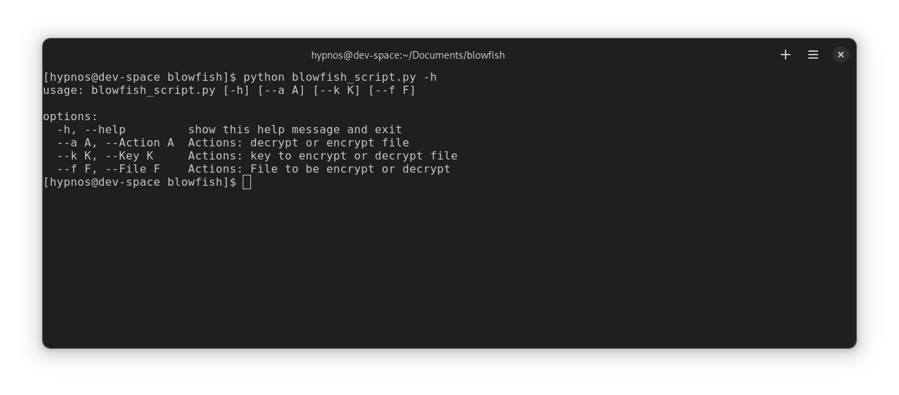

# blowfish encryption script 

### PreRequisites

- Python (on your command line)
- Git

### Installation

- Git clone this repository
  - Or git clone https://github.com/AxelVarreira/blowfish.git
- Open the root of project
- make sure to have the file that you want to encrypt on root of project (Will be improved)
- run ```python3 blowfish_script.py --k <key> --a <decrypt or decrypt> --f nome_arquivo.txt```

### Parameters

- help: List all parameters and its funcionalities
